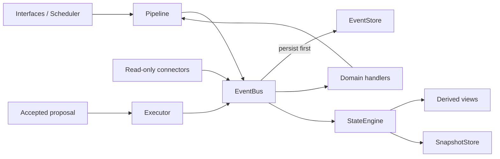

# Architecture

## Governing Flow

Required boundary:

`Interface -> EventBus -> pure domain handlers -> StateEngine -> accepted executor`

The StateEngine is the only state mutation authority. Connectors read external
systems. Executors write external systems only after server-side proposal
acceptance.

## Main Components

| Area | Location | Responsibility |
|---|---|---|
| Events and pipeline | `src/core/` | Event contracts, persistence-first delivery, replay, state |
| Durable storage | `src/storage/` | Event log, snapshots, database lifecycle |
| Domain logic | `src/domain/` | Event-to-event business rules |
| Derived state | `src/derived_state/` | Workload, cognition, planning, reflection |
| Connectors | `src/connector/` | Read-only external ingestion |
| Executors | `src/executor/` | Approval-gated external writes |
| Interfaces | `src/interface/` | FastAPI and Telegram adapters |
| Runtime composition | `src/runtime/composition.py` | Shared dependency wiring, capabilities, and lifecycle |
| Web UI | `web/src/` | React PWA |

## Runtime Modes

`build_runtime()` creates the same core stores, EventBus, StateEngine,
Pipeline, tracer, scheduler, and dead-letter queue for all entry points.
Explicit mode capabilities decide which optional interfaces and background
services start in local, Render, and worker processes.

All event types are subscribed to the StateEngine at the composition root.
Handler failures are written to the shared DLQ and produce a
`system.event_failed` event. Delivery then continues to healthy handlers.

## Known Boundary Debt

- `src/interface/api/web_routes.py` and `src/interface/telegram/bot.py` retain
  some business orchestration and in-memory interaction state. Active
  dashboard, finance, finance-undo, and calendar-conflict paths now delegate
  to `src/domain/`.
- `src/interface/api/web_routes.py` still contains unreachable legacy helper
  implementations pending a behavior-neutral cleanup.
- A legacy root-level `derived_state/` engine coexists with
  `src/derived_state/`.
- Some background tasks are created without a shared lifecycle registry.
- Schedule mirror batch writes do not yet use the accepted-proposal contract;
  production blueprint writes are therefore disabled.

Structural changes to these areas must be split into small, tested batches.
