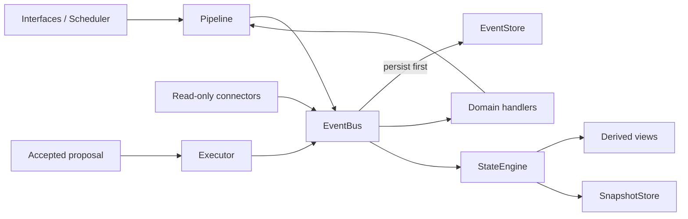

# Architecture

## Governing Flow

Required boundary:

`Interface -> EventBus -> pure domain handlers -> StateEngine -> accepted executor`

The StateEngine is the only state mutation authority. Connectors read external
systems. Executors write external systems only after server-side proposal
acceptance.

## Main Components

| Area | Location | Responsibility |
|---|---|---|
| Events and pipeline | `src/core/` | Event contracts, persistence-first delivery, replay, state |
| Durable storage | `src/storage/` | Event log, snapshots, database lifecycle |
| Domain logic | `src/domain/` | Event-to-event business rules |
| Derived state | `src/derived_state/` | Workload, cognition, planning, reflection |
| Connectors | `src/connector/` | Read-only external ingestion |
| Executors | `src/executor/` | Approval-gated external writes |
| Interfaces | `src/interface/` | FastAPI and Telegram adapters |
| Runtime composition | `scripts/run.py`, `scripts/render_run.py` | Dependency wiring and lifecycle |
| Web UI | `web/src/` | React PWA |

## Current Composition Gap

`scripts/run.py` is the complete local composition. `scripts/render_run.py`
currently wires only the StateEngine, JWXT/Google Calendar connectors, web API,
and heartbeat. Scheduler, Telegram, watchdog, legacy derived engine, and
several domain handlers are not present in the Render web process.

Until a shared composition root exists, verify the active entry point before
debugging behavior.

## Known Boundary Debt

- `src/interface/api/web_routes.py` and `src/interface/telegram/bot.py` contain
  business orchestration and in-memory interaction state.
- A legacy root-level `derived_state/` engine coexists with
  `src/derived_state/`.
- Some background tasks are created without a shared lifecycle registry.
- Schedule mirror batch writes do not yet use the accepted-proposal contract;
  production blueprint writes are therefore disabled.

Structural changes to these areas must be split into small, tested batches.
